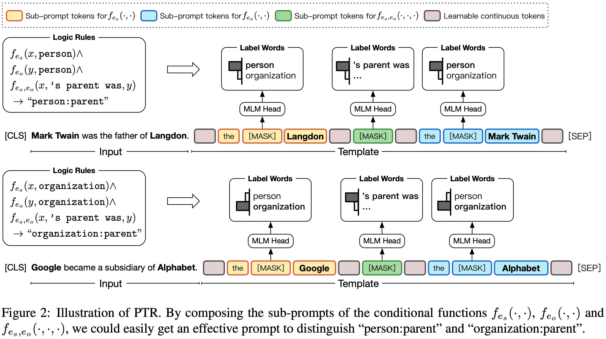
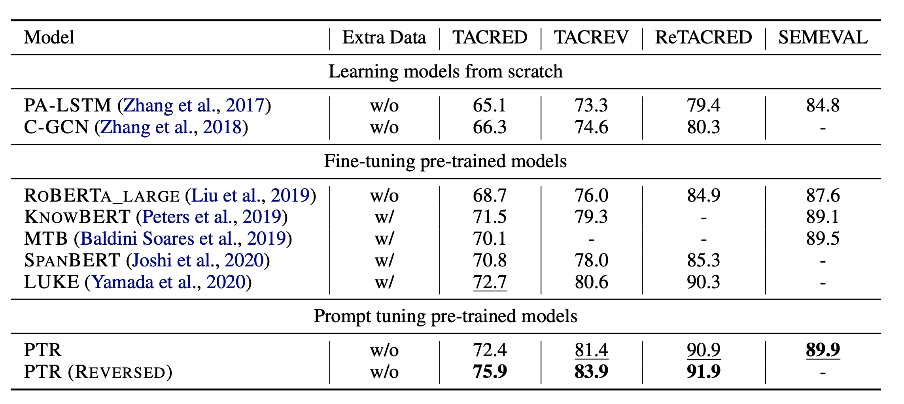

# PTR: Prompt Tuning with Rules for Text Classification


The code and datasets of our paper "[PTR: Prompt Tuning with Rules for Text Classification](https://arxiv.org/pdf/2105.11259.pdf)"

To clone the repository, please run the following command:

```bash
git clone https://github.com/thunlp/PTR.git --depth 1
```

If you use the code, please cite the following paper:

```
@article{han2021ptr,
  title={PTR: Prompt Tuning with Rules for Text Classification},
  author={Han, Xu and Zhao, Weilin and Ding, Ning and Liu, Zhiyuan and Sun, Maosong},
  journal={arXiv preprint arXiv:2105.11259},
  year={2021}
}
```


# Quick Links
+ [Overview](#overview)

+ [Requirements](#requirements)

+ [Data Preparation](#data-preparation)

+ [Experiments](#experiments)

  + [Baselines](#baselines)
  + [Reproduce Results](#reproduce-results)


# Overview
<center>

</center>
In this work, we propose prompt tuning with rules (PTR) for many-class text classification and apply logic rules to construct prompts with several sub-prompts. In this way, PTR is able to encode prior knowledge of each class into prompt tuning. You can find more details in our [paper](https://arxiv.org/pdf/2105.11259.pdf).

# Requirements

The model is implemented using PyTorch. The versions of packages used are shown below.

+ numpy==1.18.0
+ scikit-learn==0.22.1
+ scipy==1.4.1
+ torch==1.4.0
+ tqdm==4.41.1
+ transformers==4.0.0

To set up the dependencies, you can run the following command:
``` bash
pip install -r requirements.txt
```

# Data Preparation
We have provided a scripts to download all the datasets we used in our paper. You can run the following command to download the datasets:
```bash
bash data/download.sh all
```
The above command will download all the datasets including
+ Retacred
+ Tacred
+ Tacrev
+ Semeval

If you only want to download a specific dataset, you can run the following command:
```bash
bash data/download.sh $dataset_name1 $dataset_name2 ...
```
where `$dataset_nameX` can be one or multiple of `retacred`, `tacred`, `tacrev`, `semeval`.

# Experiments

<center>

</center>

## Baselines

Some baselines, especially the baselines using entity markers, come from the project [[RE_improved_baseline]](https://github.com/wzhouad/RE_improved_baseline).


## Reproduce Results in Our Work

### 1. For TACRED

```bash
bash scipts/run_large_tacred.sh
```

### 2. For TACREV

```bash
bash scripts/run_large_tacrev.sh
```

### 3. For RETACRED

```bash
bash scripts/run_large_retacred.sh
```

### 4. For Semeval

```bash
bash scripts/run_large_semeval.sh
```

